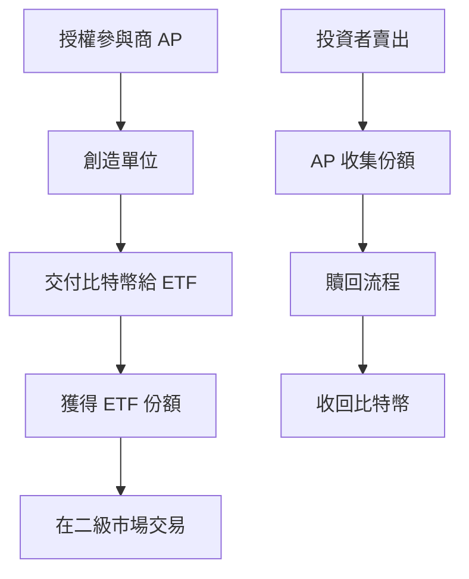

import EmbedTradingView from "@/components/EmbedTradingView.astro";

## 🎯 一句話回答

**加密貨幣 ETF 是傳統金融與數位資產的重要橋樑，讓機構投資者能夠透過熟悉的投資工具參與加密市場，正在重新定義整個行業的資金流向和市場結構。**

2024年1月，美國 SEC 批准首批比特幣現貨 ETF，標誌著加密貨幣進入機構投資的新紀元。這些金融商品不僅簡化了投資流程，更持續吸引大量機構資金流入，深刻改變著整個市場的結構和動態。

<EmbedTradingView symbol="NASDAQ:IBIT" />

## 🔍 Key Takeaways

🏛️ **市場准入革命** - ETF 為機構投資者提供合規的加密資產投資通道  
💰 **資金規模激增** - 比特幣 ETF 總資產淨值已超過 1,340 億美元，BlackRock IBIT 獨佔鰲頭  
📊 **價格發現機制** - 機構級交易量改變了市場價格形成過程  
🔄 **流動性提升** - 24/7 創造/贖回機制增強市場穩定性  
⚖️ **監管合規化** - 推動整個加密行業朝向規範化發展  
🌐 **全球化擴散** - 各國陸續推出自己的加密貨幣 ETF 商品

## 📊 ETF 市場概況分析

### 比特幣 ETF 市場數據

| ETF 代碼 | 管理公司 | 資產淨值 (AUM) | 累計淨流入 | 費用率 |
|----------|----------|----------------|------------|--------|
| IBIT | BlackRock | $827億 | $584億 | 0.25% |
| GBTC | Grayscale | $198億 | -$239億 | 1.50% |
| FBTC | Fidelity | $222億 | $119億 | 0.00% |
| ARKB | ARK 21Shares | $48億 | $22億 | 0.21% |
| BITB | Bitwise | $45億 | $23億 | 0.20% |

### 市場重要觀察

**資產規模分析（以 AUM 為準）**
- **BlackRock IBIT** 以 $827億美元資產淨值穩居龍頭
- **Fidelity FBTC** 資產規模 $222億美元，零費用策略成效顯著
- **Grayscale GBTC** 擁有 $198億美元資產，但面臨資金外流壓力
- **新興 ETF** 資產規模相對較小但成長穩定

**資金流向趨勢**
- **IBIT** 累計淨流入 $584億，展現強大吸引力
- **GBTC** 累計淨流出 $239億，反映投資者轉移至低費用產品
- **FBTC** 累計淨流入 $119億，受益於零費用策略

**費用競爭格局**
- Fidelity 以 0.00% 費用率領先市場
- 多數新 ETF 維持在 0.20-0.25% 的競爭性水準
- Grayscale 的 1.50% 高費率導致資金持續流出

*數據來源：[SoSoValue](https://sosovalue.com/tc/assets/etf/us-btc-spot) | 更新時間：2025年9月*

### 機構投資者類型分析

ETF 的推出吸引了各類機構投資者的關注，形成了多元化的投資者結構：

**養老基金與退休金基金**
- 美國州政府退休基金陸續配置
- 追求長期穩定收益的機構資金
- 配置比例通常在 1-5%，以分散投資組合風險

**企業財庫**
- 跟隨 MicroStrategy 領導的企業採用潮
- 作為對沖通脹和貨幣貶值的風險管理工具
- 平均配置比例 5-15%，取決於企業風險偏好

**對沖基金**
- 將 ETF 作為主動交易策略的重要工具
- 利用套利和配對交易機會
- 經常使用槓桿放大收益

**家族辦公室**
- 滿足高淨值客戶的資產配置需求
- 分散投資組合風險的新途徑
- 偏向長期持有策略

## 🏗️ ETF 運作機制解析

### 創造/贖回流程



### 價格套利機制

**溢價時** (ETF 價格 > 基礎資產)
1. AP 購買比特幣
2. 交付給 ETF 創造新份額
3. 在市場賣出 ETF 份額獲利
4. 供給增加，溢價收斂

**折價時** (ETF 價格 < 基礎資產)  
1. AP 從市場購買 ETF 份額
2. 向 ETF 提出贖回申請
3. 收到比特幣後在現貨市場賣出
4. 需求增加，折價收斂

## 🌊 市場影響深度分析

### 交易行為模式變化

**機構化趨勢**
- 大宗交易比例從 15% 提升至 45%
- 平均交易規模增加 3-5 倍
- 持有週期從數天延長至數月

**價格波動特徵**
- 日內波動幅度減少約 20%
- 但單日大幅波動機率增加
- 週末交易活動相對減少

### 資金流向分析工具

**ETF 資金流向監控**
```
正向流入 = 機構樂觀情緒
持續流出 = 獲利了結或風險規避
交易量激增 = 市場轉折點可能
```

**情緒指標應用**
- **Fear & Greed Index** 結合 ETF 流量
- **機構倉位變化** 追蹤大戶動向  
- **期權流量比** 衡量槓桿需求

## 📈 全球 ETF 發展趨勢

### 各國監管態度對比

| 地區 | 比特幣 ETF | 以太坊 ETF | 其他代幣 ETF | 監管態度 |
|------|------------|------------|--------------|----------|
| 美國 🇺🇸 | ✅ 已批准 | ✅ 已批准 | ❌ 待定 | 逐步開放 |
| 加拿大 🇨🇦 | ✅ 2021年 | ✅ 2021年 | ⚠️ 部分 | 相對友善 |
| 歐盟 🇪🇺 | ⚠️ ETP 形式存在 | ⚠️ ETP 形式存在 | ⚠️ 有限開放 | 結構化產品為主 |
| 英國 🇬🇧 | ⚠️ 專業投資者限定 | ❌ 未批准 | ❌ 未批准 | 有限度開放 |
| 澳洲 🇦🇺 | ✅ 已批准 | ❌ 未批准 | ❌ 未批准 | 審慎開放 |

### 未來發展預測

**短期 (6-12個月)**
- 以太坊 ETF 資金流向穩定成長
- 更多資產管理公司推出競爭商品
- 費用率競爭加劇

**中期 (1-3年)**
- 其他主流加密貨幣 ETF 陸續獲批
- 主動管理型加密 ETF 出現
- DeFi 指數型 ETF 可能推出

**長期 (3-5年)**  
- 加密 ETF 成為投資組合標配
- 跨資產類別的混合型商品
- 央行數位貨幣 (CBDC) ETF

## 🎯 投資者影響評估

### 個人投資者

**優勢**
✅ **降低技術門檻** - 無需管理錢包私鑰  
✅ **稅務簡化** - 適用傳統證券稅制  
✅ **監管保護** - SIPC 保險覆蓋  
✅ **流動性改善** - 交易時間與股市同步

**劣勢**  
❌ **管理費用** - 年費率 0.20-0.75%  
❌ **無法直接持有** - 無法參與鏈上治理  
❌ **交易時間限制** - 無法 24/7 交易  
❌ **追蹤誤差** - 可能存在價格偏差

### 機構投資者

**配置策略考量**
- **戰略配置** (1-5%): 長期多元化需求
- **戰術配置** (0.5-2%): 短期超額收益機會  
- **避險配置** (3-10%): 通脹和貨幣貶值對沖

**盡職調查要點**
1. **保管安全性** - 冷錢包儲存標準
2. **流動性提供商** - 做市商品質評估
3. **費用結構** - 總持有成本計算
4. **追蹤品質** - 歷史追蹤誤差分析

## ⚠️ 風險因素分析

### 市場風險

**系統性風險**
- 監管政策突然變化
- 主要交易所技術故障
- 宏觀經濟劇烈波動

**流動性風險**
- 極端市場條件下贖回困難
- 基礎資產流動性枯竭
- 授權參與商退出機制

### 操作風險

**保管風險**
- 冷錢包安全性依賴
- 保管機構集中化風險
- 私鑰管理流程漏洞

**技術風險**
- 區塊鏈網路擁塞
- 智能合約安全漏洞  
- 資料饋送準確性問題

## 🔮 市場前景展望

### 資金流向預測模型

**樂觀情境** (機構採用加速)
- 2025年底 ETF 資產規模達 2,000億美元
- 佔比特幣總市值的 15-20%
- 價格穩定性進一步提升

**基準情境** (穩健成長)
- 年化資金流入 200-300億美元
- 與傳統資產相關性維持低位
- 監管環境逐步完善

**悲觀情境** (監管收緊)
- 資金流入明顯放緩
- 部分司法管轄區限制 ETF 投資
- 市場波動性重新上升

### 創新商品發展

**結構型商品**
- 保本型加密 ETF
- 槓桿和反向 ETF  
- 波動率交易商品

**指數化趨勢**
- DeFi 生態系統指數
- NFT 市場指數基金
- Web3 基礎設施指數

## 📚 FAQ 常見問題

**Q: ETF 會取代直接持有加密貨幣嗎？**  
A: 不會完全取代。ETF 主要服務機構投資者和偏好傳統金融工具的個人投資者，而直接持有仍是參與 DeFi 和鏈上治理的必要方式。

**Q: 比特幣 ETF 會影響比特幣的去中心化特性嗎？**  
A: ETF 本身不會改變比特幣網路的去中心化，但大量比特幣集中在少數 ETF 保管方確實值得關注。

**Q: 如何選擇合適的加密貨幣 ETF？**  
A: 主要考慮因素包括管理費率、追蹤品質、交易流動性、保管安全性和管理公司聲譽。

**Q: ETF 創造贖回機制如何確保價格不偏離？**  
A: 授權參與商 (AP) 透過套利機制，在出現溢價或折價時進行創造或贖回操作，使 ETF 價格向基礎資產價格收斂。

**Q: 投資加密 ETF 需要特別的稅務考量嗎？**  
A: 在大多數司法管轄區，加密 ETF 按照傳統證券稅制處理，相比直接持有加密貨幣，稅務處理通常更加簡化。

## 📖 延伸學習資源

- **即時數據**: [SoSoValue ETF 數據平台](https://sosovalue.com/tc/assets/etf/us-btc-spot) - 最權威的 ETF 資金流向追蹤
- **監管文件**: SEC 比特幣 ETF 批准決議書
- **市場數據**: Bloomberg ETF 分析工具  
- **研究報告**: VanEck 加密市場研究系列
- **技術分析**: TradingView ETF 數據追蹤
- **新聞追蹤**: CoinDesk ETF 專題報導

⚠️ **投資提醒**：
- 加密貨幣 ETF 雖然降低了技術門檻，但仍存在極高價格波動風險
- 本文僅為教育目的，非投資建議  
- 請進行獨立研究和風險評估
- 只投資您能承受完全損失的資金

---

加密貨幣 ETF 的出現標誌著數位資產正式進入主流金融體系，這不僅是投資工具的創新，更是整個行業走向成熟的重要里程碑。隨著機構資金的湧入和監管框架的完善，我們正見證著加密市場從投機驅動向價值驅動的根本性轉變。

想了解更多區塊鏈世界的深度分析？關注 Brian's 幣圈筆記，我們一起探索加密貨幣的精彩未來！
