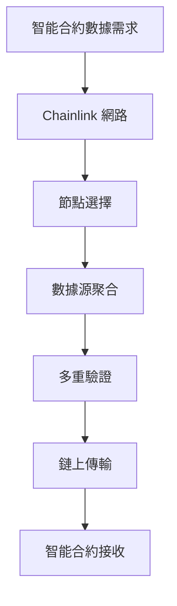

import EmbedTradingView from "@/components/EmbedTradingView.astro";

> **一句話回答：Chainlink 是區塊鏈世界的「數據郵差」，專門負責將現實世界的價格、天氣、體育比分等資訊安全可靠地傳送給智能合約使用。**

當你在 DeFi 平台上看到 ETH/USD 價格自動更新，在保險 DApp 中根據天氣理賠，或是預測市場根據選舉結果結算時，背後都有一個默默工作的「數據橋接者」——Chainlink。

這個被稱為「預言機之王」的項目，正在解決區塊鏈技術面臨的一個根本問題：**如何讓封閉的區塊鏈網路獲取外部世界的真實數據？**

<EmbedTradingView symbol="BINANCE:LINKUSDT" />

## 🔍 預言機問題：區塊鏈的「資訊孤島」困境

### 區塊鏈的天生缺陷

區塊鏈網路在設計上是**確定性**和**封閉性**的系統：

```
區塊鏈特性：
✅ 去中心化：沒有單一控制點
✅ 不可變：交易記錄無法篡改  
✅ 透明性：所有交易公開可見
❌ 外部資料存取：無法直接獲取鏈外資訊
```

**問題來源**：
- **網路隔離**：區塊鏈節點只能處理網路內的資訊
- **確定性要求**：所有節點必須得到相同結果才能達成共識
- **安全優先**：外部資料來源可能引入單點故障

### 智能合約的「資料饑渴」

智能合約要執行複雜商業邏輯，需要大量外部數據：

#### DeFi 應用場景
```markdown
🏦 借貸協議：需要即時 ETH/USD 價格決定清算
📊 合成資產：需要股票、商品價格生成代幣
🎯 預測市場：需要選舉、體育賽事結果
💰 穩定幣：需要法定貨幣匯率維持錨定
```

#### 傳統金融對比
```
傳統系統：Bloomberg Terminal → 即時金融數據
智能合約：需要預言機 → 鏈外數據餵養
```

沒有可靠的數據來源，區塊鏈就像是一座**資訊孤島**，無法發揮真正的商業價值。

## 🌉 Chainlink 解決方案：去中心化預言機網路

### 核心架構設計

Chainlink 採用**多層去中心化**架構解決預言機問題：



#### 1. **節點網路層**
```
去中心化節點運營商：
• 獨立節點運營者
• 企業級數據提供商
• 學術機構和研究組織
• 激勵機制確保誠實行為
```

#### 2. **數據源層**
```
多重數據來源：
• 傳統金融 API (Bloomberg, Reuters)
• 加密貨幣交易所 (Coinbase, Binance)
• 物聯網設備數據
• 政府和機構數據庫
```

#### 3. **聚合驗證層**
```
數據處理流程：
收集 → 驗證 → 聚合 → 加權平均 → 異常檢測 → 最終結果
```

### 技術創新特點

#### 🔐 **去中心化安全**
```
安全機制：
□ 多節點驗證防止單點故障
□ 聲譽系統獎勵優質節點
□ 抵押機制懲罰惡意行為
□ 數據聚合減少操縱風險
```

#### ⚡ **靈活性與擴展性**
- **模組化設計**：可適配不同區塊鏈
- **自定義預言機**：滿足特殊數據需求
- **多種數據類型**：價格、事件、隨機數等

#### 💰 **經濟激勵模型**
```
LINK 代幣功能：
→ 節點運營商抵押保證金
→ 數據請求方支付服務費
→ 優質服務獲得更多獎勵
→ 惡意行為扣除抵押代幣
```

## 💡 LINK 代幣經濟學深度解析

### 代幣基本資訊

```markdown
代幣名稱：Chainlink (LINK)
總供應量：1,000,000,000 LINK
當前流通：約 508,099,970 LINK (50.8%)
代幣標準：ERC-677 (ERC-20 兼容)
共識機制：Proof of Stake (節點抵押)
```

### 核心經濟功能

#### 1. **服務支付媒介**
```
數據請求流程：
智能合約 → 支付 LINK → 預言機服務 → 獲得數據
```

#### 2. **節點抵押機制**
```
抵押激勵設計：
高抵押 = 更高可信度 = 更多工作機會 = 更多收入
低抵押 = 較低可信度 = 較少工作機會 = 較少收入
```

#### 3. **網路安全保障**
```
懲罰機制：
提供錯誤數據 → 扣除抵押 LINK → 降低聲譽 → 失去工作機會
```

### 供需動態分析

#### 需求端驅動力
```markdown
📈 DeFi 總鎖倉價值 (TVL) 增長
📊 新預言機服務類型擴展
🌍 多鏈生態系統發展
🏢 企業級客戶採用
```

#### 供給端特性
```markdown
📦 固定總量上限 (10億枚)
⏰ 通脹率逐年遞減
🔒 節點抵押鎖定流通供給
💼 機構長期持有減少市場流通
```

### 🔒 Chainlink Staking：代幣經濟學的重大升級

**2022年12月**，Chainlink 推出了期待已久的 **Staking v0.1**，並於 **2024年11月** 升級到 **v0.2 版本**，這是 LINK 代幣經濟學歷史上最重要的里程碑。

#### 💎 Staking 機制核心功能

**什麼是 Chainlink Staking？**
LINK 持有者可以將代幣質押到協議中，參與網路安全維護並獲得獎勵，同時承擔一定風險以確保資料品質。

**三大核心功能**：

1. **🛡️ 網路安全增強**
   - 質押者承擔「削減風險」，如果提供錯誤資料將被懲罰
   - 增加攻擊網路的經濟成本
   - 提升整體資料餵送的可信度

2. **💰 獎勵分配機制**
   - 質押者獲得協議收入分成
   - 年化收益率通常在 **4-8%** 範圍
   - 獎勵來自網路使用費用和協議通脹

3. **🗳️ 治理參與權**
   - 質押者可參與重要協議決策
   - 優先獲得新功能測試資格
   - 對網路發展方向擁有發言權

#### 🏦 Staking v0.2 重大升級

**2024年11月推出的 v0.2 版本帶來關鍵改進**：

```markdown
📊 Staking v0.2 核心指標 (2025年最新)
總質押上限: 4,500萬 LINK (約總供應量 4.5%)
當前質押率: ~65% 完成度
年化收益率: 4.5-7.2% (動態調整)
削減懲罰: 最高質押金額的 5%
解鎖週期: 21-28 天
```

**主要改進特點**：
- ✅ **風險細化管理**：不同等級的削減懲罰機制
- ✅ **收益率優化**：動態調整機制確保競爭力
- ✅ **用戶體驗提升**：簡化質押操作流程
- ✅ **規模擴大**：支援更多 LINK 參與質押

#### 💡 對 LINK 價值的深遠影響

**直接影響**：
1. **🔒 供應量減少**：大量 LINK 鎖定在質押池中
2. **💎 持有激勵**：提供被動收入來源，減少拋售壓力
3. **📈 基本面強化**：Staking 收益率反映網路真實使用情況

**網路效應**：
```
更多質押 → 網路更安全 → 吸引更多用戶 →
收入增加 → 質押收益提升 → 更多質押
```

#### ⚠️ 參與風險與注意事項

**主要風險**：
- **削減風險**：惡意行為或技術故障可能導致質押損失
- **流動性風險**：21-28天解鎖期間無法交易
- **技術風險**：智能合約潛在漏洞
- **機會成本**：錯過其他高收益投資機會

**參與建議**：
- 只質押你能長期鎖定的 LINK
- 理解削減機制和風險分級
- 關注質押池狀態和網路健康指標
- 考慮分散質押以降低風險

#### 📈 Staking 數據追蹤指標

**關鍵指標監控**：
```markdown
🎯 必須追蹤的數據
質押參與率: 目前 ~65%，目標 80%+
平均年化收益: 動態範圍 4-8%
削減事件頻率: 越低越好 (理想為零)
網路使用費收入: 直接影響獎勵分配
解質押等待隊列: 反映市場情緒
```

**資料來源**：
- [Chainlink Staking App](https://staking.chain.link/)
- [Staking 統計儀表板](https://data.chain.link/staking)
- [社群追蹤工具](https://dune.com/chainlink)

## 🏗️ Chainlink 生態系統全景

### 核心產品矩陣

#### 1. **Price Feeds (價格餵送)**
**最廣泛使用的服務**，為 DeFi 協議提供可靠資產價格：

```
支援資產類別：
• 加密貨幣：BTC, ETH, ADA, SOL...
• 傳統資產：金、銀、石油、股票指數
• 外匯：USD, EUR, JPY, GBP...
• 商品：小麥、玉米、天然氣...
```

**主要客戶**：
- **Aave**：借貸協議價格數據
- **Compound**：利率和抵押品定價
- **Synthetix**：合成資產價格錨定
- **dYdX**：衍生品交易定價

#### 2. **VRF (Verifiable Random Function)**
提供**可驗證隨機數**服務：

```
應用場景：
🎲 NFT 隨機屬性生成
🎮 區塊鏈遊戲隨機事件
🎯 公平抽獎和彩票系統
⚖️ 去中心化治理隨機選擇
```

**技術優勢**：
- 密碼學可證明隨機性
- 無法預測或操縱結果
- 鏈上可驗證真實性

#### 3. **Keepers (自動化執行)**
為智能合約提供**去中心化自動化**服務：

```
自動化任務：
📅 定時觸發合約函數
📊 基於條件的交易執行
💰 清算和再平衡操作
🔄 定期維護任務
```

**成本效益**：
- 降低 gas 費用消耗
- 提高執行可靠性
- 減少人工監控需求

#### 4. **Any API (任意 API)**
連接任何外部 API 到區塊鏈：

```
數據來源：
🌤️ 天氣數據 (保險理賠)
📈 股票價格 (傳統金融 DeFi)
🏆 體育結果 (預測市場)
📊 IoT 傳感器 (供應鏈追蹤)
```

### 跨鏈生態擴展

Chainlink 支持多個區塊鏈網路：

```
主要支持鏈：
🔷 Ethereum (最成熟生態)
🔶 Binance Smart Chain (高吞吐量)
🟣 Polygon (低 gas 費)
🔴 Avalanche (高性能)
🟢 Arbitrum & Optimism (L2 擴容)
🟨 Solana (高 TPS)
```

**跨鏈優勢**：
- 降低對單一鏈的依賴
- 擴大市場覆蓋範圍
- 提高服務可用性

## 📊 DeFi 生態中的戰略地位

### 基礎設施層級重要性

Chainlink 在 DeFi 堆疊中扮演**基礎設施層**角色：

```
DeFi 技術堆疊：
應用層: Uniswap, Aave, Compound...
     ↓
協議層: 借貸、交易、合成資產協議
     ↓
預言機層: Chainlink (數據餵送)
     ↓
區塊鏈層: Ethereum, BSC, Polygon...
```

### 網路效應與護城河

#### **數據網路效應**
```
更多數據源 → 更準確價格 → 更多 DeFi 採用 → 更多收入 → 吸引更多節點 → 更多數據源
```

#### **信任累積效應**
```
長期穩定運行 → 建立市場信任 → 成為行業標準 → 提高轉換成本 → 鞏固市場地位
```

### 與競爭對手比較

| 特徵比較 | Chainlink | Band Protocol | DIA | Tellor |
|---------|-----------|---------------|-----|--------|
| **去中心化程度** | 高 | 中等 | 中等 | 高 |
| **數據來源多樣性** | 最豐富 | 良好 | 良好 | 基本 |
| **市場採用度** | 領先 | 追趕 | 小眾 | 小眾 |
| **跨鏈支持** | 最廣泛 | 有限 | 有限 | 有限 |
| **企業客戶** | 最多 | 較少 | 較少 | 很少 |

## 🚀 技術發展與未來規劃

### Chainlink 2.0 升級計劃

#### **DON (Decentralized Oracle Networks)**
```
下一代預言機網路：
• 更高吞吐量和更低延遲
• 更強的去中心化和安全性
• 支援更複雜計算任務
• 降低運營成本
```

#### **混合智能合約**
```
鏈上 + 鏈下計算結合：
鏈上：去中心化和不可變性
鏈下：複雜計算和外部連接
```

#### **Off-Chain Reporting (OCR)**
```
效率提升機制：
• 單次交易聚合多節點報告
• 大幅降低 gas 費用消耗
• 提高數據更新頻率
• 支持更多數據類型
```

### 產品路線圖

#### **短期目標** (2025)
- 擴展更多區塊鏈支持
- 增加企業級客戶服務
- 優化 gas 費用效率

#### **中期願景** (2026-2027)
- 建立跨鏈互操作性標準
- 推出更多垂直領域解決方案
- 深化傳統金融機構合作

#### **長期目標** (2028+)
- 成為 Web3 數據基礎設施標準
- 連接所有數位和物理世界數據
- 建立去中心化數據經濟體系

## 💰 LINK 代幣經濟模式

### 經濟模型運作機制

#### **代幣功能**
```markdown
🔧 服務支付：智能合約支付 LINK 獲取數據
🛡️ 抵押保證：節點運營商抵押 LINK 提供服務
⚖️ 激勵機制：優質服務獲得更多 LINK 獎勵
🔒 安全保障：惡意行為會被扣除抵押代幣
```

#### **供需動態**
```markdown
需求來源：
• DeFi 協議數據需求增長
• 新區塊鏈網路整合
• 企業級客戶採用
• 新產品功能推出

供應特性：
• 總量固定上限 (10億枚)
• 節點抵押減少流通供給
• 服務支付產生消耗
```

### 潛在風險因素

#### **技術層面**
- 智能合約安全性挑戰
- 節點運營商去中心化程度
- 競爭對手技術創新

#### **市場環境**
- DeFi 整體發展波動
- 法規政策變化影響
- 加密貨幣市場週期性

#### **營運挑戰**
- 企業客戶留存率
- 新產品開發時程
- 團隊執行能力

### 生態系統健康指標

```markdown
技術採用：
• 節點數量和地理分佈
• 數據請求頻率和種類
• 新整合協議數量
• 跨鏈部署覆蓋率

市場表現：
• 協議收入增長趨勢
• 企業合作案例數量
• 開發者社群活躍度
• 競爭對手市場動態
```

## 🌟 實際應用案例研究

### 案例 1：Aave 借貸協議
**問題**：如何安全確定抵押品價值和清算觸發點？

**Chainlink 解決方案**：
- 提供 ETH/USD, BTC/USD 等即時價格餵送
- 多節點驗證確保價格準確性
- 自動觸發清算保護協議安全

**結果影響**：
- Aave TVL 超過 $100 億
- 零重大價格操縱事件
- 成為 DeFi 借貸標準

### 案例 2：PoolTogether 無損彩票
**問題**：如何產生公平、可驗證的隨機獲勝者？

**Chainlink VRF 解決方案**：
- 密碼學可驗證隨機數生成
- 無法預測或操縱結果
- 透明公正的開獎過程

**結果影響**：
- 累計存款超過 $1 億
- 零隨機數爭議事件
- 推動 DeFi 遊戲化創新

### 案例 3：Synthetix 合成資產
**問題**：如何準確追蹤股票、商品、外匯價格？

**Chainlink Price Feeds 解決方案**：
- 支持 TSL A, AAPL, 黃金、白銀價格
- 高頻率更新保持價格同步
- 多重數據源防止單點故障

**結果影響**：
- 合成資產 TVL 超過 $10 億
- 擴展 DeFi 到傳統資產類別
- 降低傳統金融進入門檻

## 🔍 技術發展追蹤指標

對於想要了解 Chainlink 發展狀況的讀者，可以關注以下客觀指標：

### 網路健康度指標

#### **技術採用數據**
```markdown
📊 節點數量和分佈情況
📈 數據請求交易量趨勢
🔗 新集成協議數量
🌐 支援區塊鏈網路擴展
```

#### **生態系統發展**
```markdown
🏗️ 新產品功能發布
🤝 企業級客戶合作案例
🔄 跨鏈互操作性進展
📚 開發者社群活躍度
```

### 市場環境觀察

#### **行業發展趨勢**
- DeFi 整體生態系統成長
- 預言機賽道技術競爭動態
- 監管政策發展方向
- 企業區塊鏈採用進展

#### **技術創新方向**
- Layer 2 解決方案整合
- 跨鏈預言機標準建立
- 新興數據類型支援
- 計算能力擴展計畫

## 💡 結語：數據橋接的未來

Chainlink 正在建構一個**去中心化數據經濟體系**，連接區塊鏈與現實世界。作為「預言機之王」，它不只是技術提供者，更是 Web3 基礎設施的關鍵建設者。

**核心價值主張**：
- 🌉 **橋接功能**：連接鏈上智能合約與鏈下真實世界
- 🛡️ **信任機制**：多重驗證確保數據可靠性  
- 🚀 **創新推動**：讓複雜 DeFi 應用成為可能
- 📈 **成長潛力**：隨著 Web3 發展而擴大影響力

隨著 DeFi、NFT、遊戲化金融、實體資產代幣化等應用持續發展，對於可靠外部數據的需求只會不斷增加。Chainlink 建立的技術護城河和市場信任，讓它在這個「數據就是新石油」的時代中佔據了戰略制高點。

**技術發展觀察重點**：
- Chainlink 解決的是 Web3 發展的根本需求
- 網路效應和信任累積形成強大技術優勢
- 基礎設施層地位在生態系統中日益重要
- 產品創新和企業客戶拓展值得持續關注

在區塊鏈從「純金融」走向「實體應用」的過程中，預言機將扮演越來越重要的角色。Chainlink 作為這個領域的技術領導者，其發展動向反映了整個 Web3 基礎設施的演進趨勢。

⚠️ **投資提醒**：
- LINK 存在極高價格波動風險
- 本文僅為教育目的，非投資建議
- 請進行獨立研究和風險評估
- 只投資您能承受完全損失的資金

---

*📈 想即時追蹤 LINK 價格動態？查看上方 TradingView 圖表，掌握最新市場走勢！*
